# Higher Rate Tax Payer Pension Relief

This might sound like a boring topic, but if you’re contributing to a pension scheme, you’re earning above **£50,271**, and you have no idea what the title means — keep reading — you’ll thank me later.

⚠️ Disclaimer: This is by no means an attempt to tell anyone what they should do — the main purpose of this document is to bring this to your attention. You should always question everything when it comes to your finances, think for yourself, and when in doubt consult a certified professional — it will be worth the fee.

Even if it doesn’t apply to your current circumstances, it may still be relevant for past or future years. Pension schemes can switch between [`Net Pay` (Salary Sacrifice)](#how-pension-contributions-work) and [`Relief at Source`](#how-pension-contributions-work), and many people don't realise this. Higher-rate relief applies **only** for years where your contributions were taken under `Relief at Source` — so it’s worth checking your provider’s statements to confirm.

With this said, if you’re a higher rate taxpayer (above £50,271), this document will allow you to potentially claim a decent amount of money from HMRC — reportedly there’s over a billion pounds of unclaimed tax relief just sitting there, and you can claim up to 4 years in the past.

**Do this before the end of this tax year and you can claim all the way back** (e.g. while we’re in tax year 2025/2026, you can claim all the way back to 2021/2022)!

I haven’t really found any good guides on how to exactly do this apart from articles saying “during Self Assessment” or “send a letter” so I will go into the most important details on how to claim and where to get the required information. In addition, below is a pretty good article to get you started if you want an external source:

- https://getpenfold.com/news/claim-higher-rate-pension-tax-relief

# How pension contributions work

Unless you explicitly opt-out, every month, a percentage of your salary is being paid into a pension plan. In the UK, there are two main methods of how your pension contributions are made:

- `Net Pay` (aka Salary Sacrifice)
    - This is subtracted before any income tax is paid on your salary
    - This is subtracted before NI (National Insurance) contributions are made
    - It effectively lowers your taxable income so HMRC does not tax you on the contributions, **there’s nothing to claim back**
    - This is generally a very good option if allowed by the employer
- `Relief at Source`
    - It's clear to see that you are on this by looking at your statements - there will be a tax relief added to your fund next to your contributions every month
    - Used by a lot of companies as it offloads a lot of the accounting workload
    - The contributions are made after your salary is taxed and NI contributions are made, meaning there’s A LOT of tax on it before it goes anywhere
    - The pension provider (e.g. Royal London) claims basic rate relief (20%) from HMRC on your behalf. They top up your contribution so that the gross amount equals your contribution plus 25%.

# What is Higher Rate Pension Tax Relief

With `Net Pay` (aka Salary Sacrifice) this is not a problem - you don’t actually get taxed at all on your contributions because they get subtracted before any tax is taken - you’re all good. The knowledge here will still be useful in case your company changes providers or you change jobs.

---

With `Relief at Source` you only get 20% relief by default - basically HMRC assumes that you’ve only paid 20% tax on the money that you put in the pension. 

ℹ️ It’s easy to see that you’re on `Relief at Source` by just looking at your pension provider statement - if they have tax relief added, that’s what you’re on.

Now with this confirmed, if you’re a higher rate taxpayer, the far end of your income is taxed at 40% before the contribution was taken out of it. It means that you’ve overpaid tax on your pension contributions because it shouldn’t have been taxed at all!

It is that extra 20% that we want to claim back, and the amount available to claim is capped at the value of all the income you had in your higher band (because that is the amount you paid 40% tax on).

Example (for 2025/2026):

- You earn: 60k (income tax: £11,432, NI: £3,210.60) → Take home pay: £45,357.40
- You contribute to pension: £3000 (5% of salary)
- Your pension value : £3000 + £750 (20% gross relief) + employer contribution (irrelevant)
    - It’s 20% tax relief on gross so effectively 25% of the net contribution amount because it’s 20% of the gross amount (your net contribution is treated as 80% of gross, 20% is £750 - calculated like this: £3000/80*100 = £3750)
    - The other 20% you can claim at the higher rate is the remaining 20% of gross again, so another **£750 as unclaimed relief**
- The maximum amount that can attract the extra 20% relief is the portion of your income taxed at the higher rate — in this example, £60,000 – £50,271 = **£9,729**.
    - this means with this example of £60k salary you can still lump sum around £6k and also get the additional relief on it
- Example values per year (with 5% contributions)

| **Salary** | **Contribution** | **Relief received** | **Unclaimed Relief** |
| --- | --- | --- | --- |
| £55000 | £2750 | £687.50 | **£687.50** |
| £60000 | £3000 | £750.00 | **£750.00** |
| £65000 | £3250 | £812.50 | **£812.50** |
| £70000 | £3500 | £875.00 | **£875.00** |
| £75000 | £3750 | £937.50 | **£937.50** |

It is the **Unclaimed Relief** that we’re after and HMRC is obligated to send it back to us since they were not supposed to tax us at all on our pension contributions.

# How to claim it

I will describe in more detail how to get the numbers at the end of this section, for now, there’s 3 ways that this can be claimed.

## PAYE with no Self Assessment (current and previous years)

For the first time, this year (2025), HMRC introduced an online service for people on PAYE who don’t file Self Assessment. And you can use this service to make a claim for **4 years back**! Previously, without Self Assessment, the only way to claim was a letter. If you did Self Assessment in earlier years, you still need to amend those returns or write to HMRC. 

https://www.gov.uk/guidance/claim-tax-relief-on-your-private-pension-payments

The “What you’ll need” section on the gov.uk page explains everything that is needed to make the claim so it should be a matter of registering for the Government Gateway and going through the forms.

The page says **“Use this service if you are claiming tax relief through your tax code for just the current tax year.”** Don’t worry, this is another inconsistency, it actually allows you to choose later on:

<a href="assets/images/hmrc-relief-claim-form-year-selection.png">
  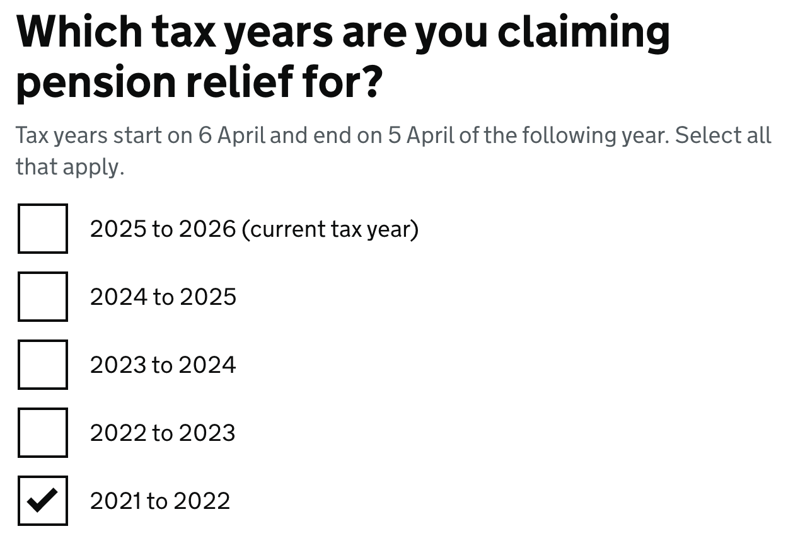
</a>

## Self Assessment (last tax year)

If you’re filing a Self Assessment this year for whatever reason already (like employment break, work abroad etc.) then this should be very straightforward.

The forms are really easy and pretty much anyone should be able to do this on their own - there’s just a bunch of questions to answer, put a bunch of numbers in and it’s done - simple right? WRONG!

⚠️ The gotcha is in the following choice during the `Tailor your Return` section

<a href="assets/images/hmrc-sa-tailor-your-return-pension-selection.png">
  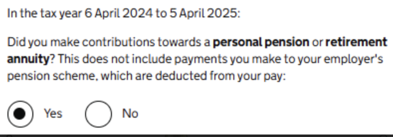
</a>

As you can see, it clearly states **“This does not include payments you make to your employer’s pension scheme, which are deducted from your pay”**. 

Even in the help section of this field there are these two:

<a href="assets/images/hmrc-sa-tailor-your-return-pension-help-1.png">
  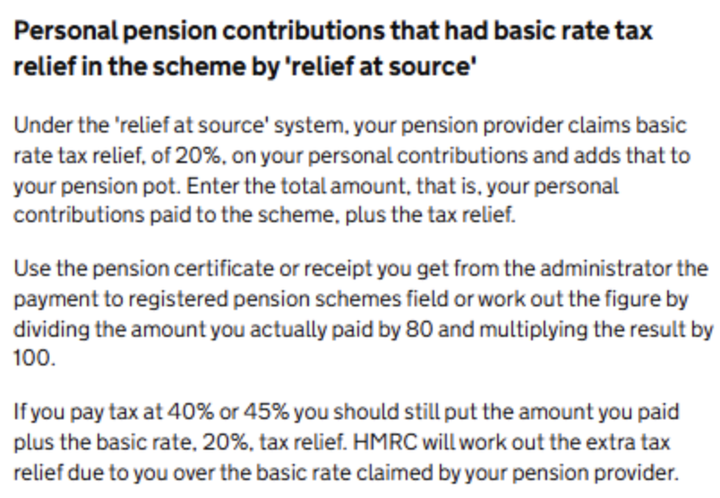
</a>
<a href="assets/images/hmrc-sa-tailor-your-return-pension-help-2.png">
  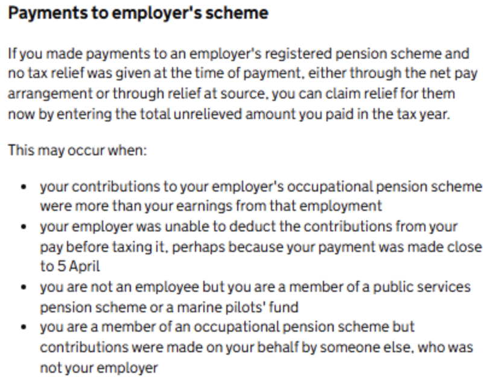
</a>

The first one mentions `Personal pension` specifically even when talking about `Relief at Source` and the `Employer’s scheme` section is not clear enough, maybe except “Your employer was unable to deduct the contributions from your pay before taxing it” - but the example given is garbage.

So naturally, for years I have been selecting `No` and never claimed anything. From what I gather, the extra tax relief is not common knowledge and most people do the same thing. 

If you’ve paid any additional lump sums into your pension then maybe you’d choose this, but as far as I was concerned these were payments deducted from my pay and not a personal scheme, so N/A.

Selecting `Yes` on this form activates a whole new section in your return that is not visible otherwise.

<a href="assets/images/hmrc-sa-pension-section-title.png">
  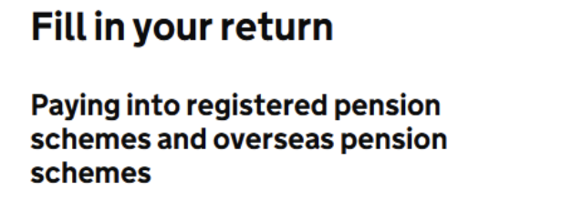
</a>

As you can see below, these two fields now have a proper description that tell us exactly what to add in here. They describe everything we’ve talked about earlier in great detail - the thing is most people never actually get to see this screen.

<a href="assets/images/hmrc-sa-pension-section-help-1.png">
  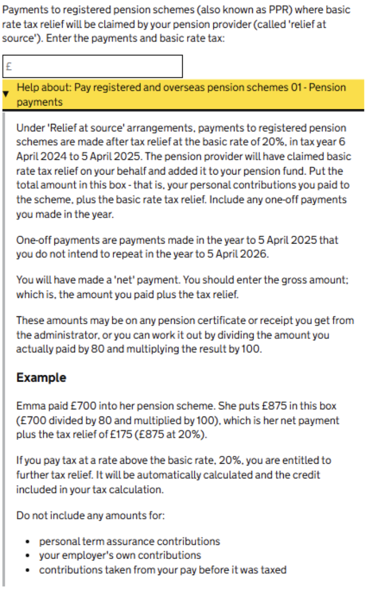
</a>
<a href="assets/images/hmrc-sa-pension-section-help-2.png">
  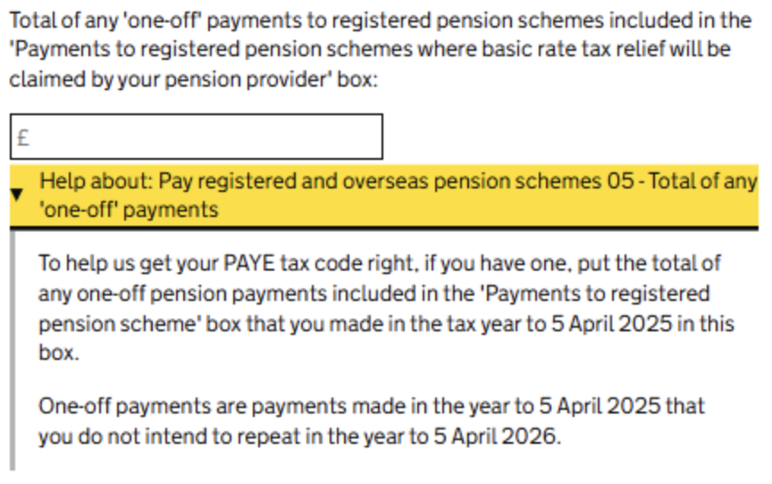
</a>

🚮 Tip: If you want to see exactly what impact these numbers have on your return:

- fill everything out without this section activated (by selecting `No`)
- go all the way to the end to view your calculation (this is safe) without submitting the return
- go back to `Tailor your return`, add the section and put the numbers in
- compare to the new calculation = profit

## Self Assessment (previous years)

You can still amend the *previous tax year’s* return (within 12 months of the filing deadline) - just use the instructions in the section above to modify it - the money will be in your account within two weeks. For earlier years, you must write to HMRC — you can’t use the online claim service if you already submitted Self Assessment for that year.

If you try the online application from the earlier paragraph (meant for non Self Assessment PAYE) it will lead you to this dead end:

<a href="assets/images/hmrc-relief-claim-self-assessment-question.png">
  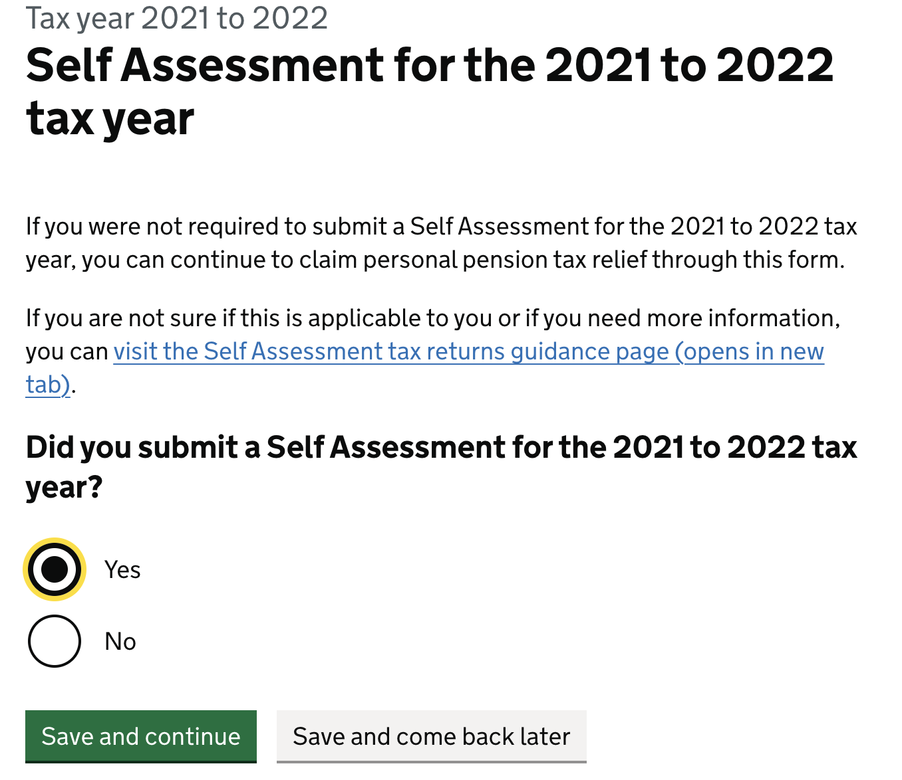
</a>
<a href="assets/images/hmrc-relief-claim-self-assessment-sa-selected.png">
  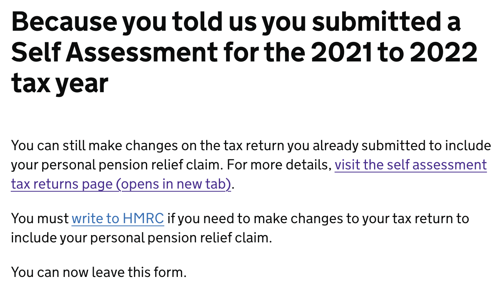
</a>
<a href="assets/images/hmrc-sa-update-instructions.png">
  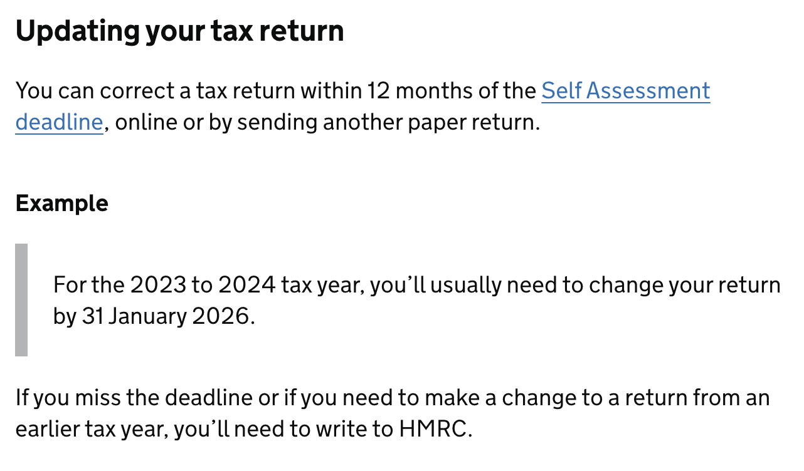
</a>

ℹ️ So again, this basically means **you can still amend last year’s tax return** online by adding the missing section (described in Self Assessment (last tax year - 2024/2025)) but beyond that, you’ll have to take the long route.

In order to do this, you will have to send a letter to HMRC. Make sure you cross reference what you put on there with the **“What you’ll need”** section on the official site:

https://www.gov.uk/guidance/claim-tax-relief-on-your-private-pension-payments

I’ve attached an example template but you can find these online as well easily by just looking for “Higher tax relief claim template” if you don’t like this one:

[template_higher_tax_relief_claim-hmrc-letter.docx](assets/templates/hmrc-higher-rate-relief-letter.docx)

As to when to expect a reply about this, if you were to send it today (23 Oct 2025):

<a href="assets/images/hmrc-expected-letter-reply.png">
  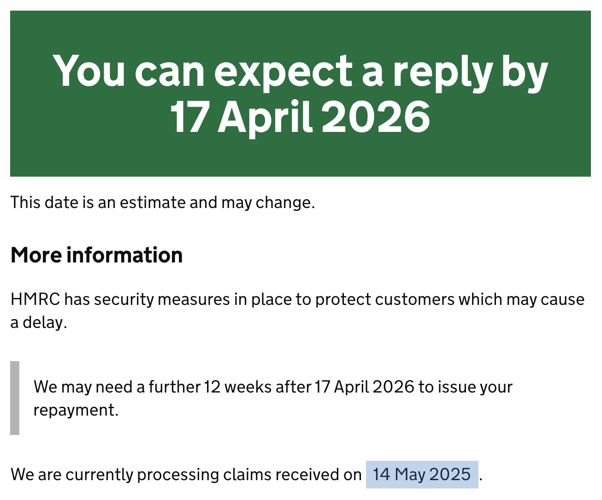
</a>

So this might take a while... but as long as you send it before the end of this tax year you should be fine.

# How to get the numbers

For the online form (PAYE only, no Self Assessment), it should be relatively straightforward - the form will guide you.

For Self Assessment - remember that the number that gets put in the box and put in the letter has to be the gross value, so net contributions + tax relief (do not include employer’s contributions). Refer to the help box on the Self Assessment for a detailed description.

### Example pension provider (Royal London)

All the information should be available in your pension provider portal and if it’s not there, they do need to provide this information to you on request. For example, for Royal London you can go to your policy details, then under CONTS. PAID, you can select `Previous Tax Year` and click `Print Plan Summary`. For previous years, those statements are not available so you need to send them an email - you will need this to be attached as evidence anyway (when filling the form or sending a request by post) on top of your calculation.

<a href="assets/images/royal-london-plan-summary-button.png">
  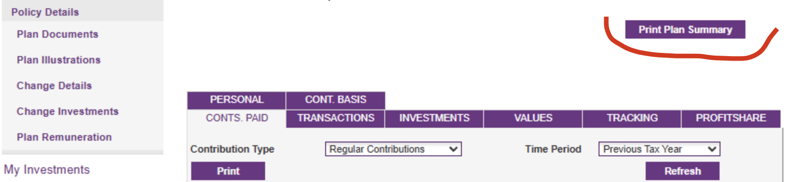
</a>

Then on the statement sum the totals for these two:

<a href="assets/images/royal-london-statement.png">
  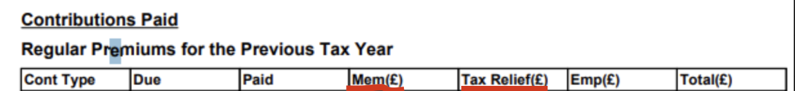
</a>

That will be your gross contribution (net contribution + relief).

# 📅 **Deadlines**

- You can amend your Self Assessment within 12 months of the filing deadline (e.g. 31st of January 2026 for 2023/2024 tax year)
- You can claim the overpaid tax due to missed pension relief up to **4 years after the end of the tax year** (e.g. up to 2021/2022 while the current tax year is 2025/2026)

# 100k-125k salary and the 60% tax trap

Now this is where it gets even more interesting. If you’re breaching the 100k barrier, you probably know that for every 2 pounds you earn, you lose 1 pound of your allowance, pushing more of your tax-free income straight into the 40% bracket. Because it’s every 2 pounds, the effective income tax on anything you earn above 100k and below 125k is 60%. What you might not know is how this relief affects this calculation even if you’re not doing Self Assessment.

This is especially useful for when you’re inside this range; once you go over 125k, the additional benefits will get smaller.

Example:

- You earn: 115k
- Your pension contributions: **£5750 + £1430** (20% relief)
- Your unclaimed relief is: £1430

Now on top of the £1430 refund for the relief, what claiming this is also doing is reporting this £1430 as not income anymore when before it was taxed at 60%. This ripples throughout the year since through your PAYE, 1/12 of this was paid to you every month while being taxed 60% - now that it is not income anymore, not only should you not pay any tax on it, but you also reclaim it from the lost Personal Allowance, reducing your overall tax due for even more refund.

Just claiming the higher rate tax relief will actually give you more refund than the 20% you’d expect.

### Potential for lump sum top up

So while a lump sum top up of your pension to take you below the 100k threshold with `Salary Sacrifice` is an easy choice because it’s so obvious, claiming it as relief when using `Relief at Source` seems to work as well. 

In theory, if you wanted to get 10k into your pension and the entirety of that 10k was in the 100–125k range (remember your total would have already been reduced by the original gross contribution after you do the higher rate claim for that part), it should work like this:

- You contribute (from after-tax): -£8,000 (from your pocket)
- Provider adds 20% (basic relief): £2,000 (into your pension)
- You reclaim 20% via Self Assessment: +£2,000 (into your pocket)
- Adjusted income reduction: £10k gross - restores £5,000 allowance
    - 40 % × £5,000 = +£2,000 tax saved (into your pocket)

Totals:

- Pension credited: £8000 + £2000 = **£10,000**
- Net cost to you (take home pay reduced): £8000 - £2000 (relief) - £2000 (refund) = **£4000**

So this is a 150% instant ROI into your pension. If you’re not investing it for some big profit and just sticking it into an ISA - think about how many years of compound interest it would need to even get to this value.

Most pension providers also allow taking out 25% of your pension at the age of 55 (will increase to 57 on 6 April 2028) tax-free, which means there’s a good chance you can take out £2,500 back out of the £4,000 you put in (+ interest) before you kick the bucket.

Comparison between `Salary Sacrifice` and `Relief at Source`:

| Method | You pay from salary | Pension credited | Cash/tax saved | Net cost | Effective relief |
| --- | --- | --- | --- | --- | --- |
| **Salary Sacrifice** | £10 000 gross sacrifice | £10 000 | £6 200 (= tax + NI saved) | **£3 800** | **62 % (+ NI up to 76 %)** |
| **Relief at Source** | £8 000 net contribution | £10 000 | £4 000 (refunds + allowance) | **£4 000** | **60 %** |

# Changes to salary sacrifice for pensions from April 2029

There was a recent announcement that from April 2029, only the first £2,000 of employee pension contributions through salary sacrifice each year will be exempt from NICs.

In the context of higher rate pension tax relief this is mostly irrelevant.

This change should only affect you if you’re using `Net Pay` (Salary Sacrifice). For `Relief at Source`, we’re already paying full NI and full tax upfront on our contributions (with income tax then relieved via basic and higher rate relief).

Effectively, what this will do is cause you to have to pay NI contributions on the money you put into your pension above £2,000 even though it’s not treated as take-home income, whereas before it would all have been exempt from NI.
